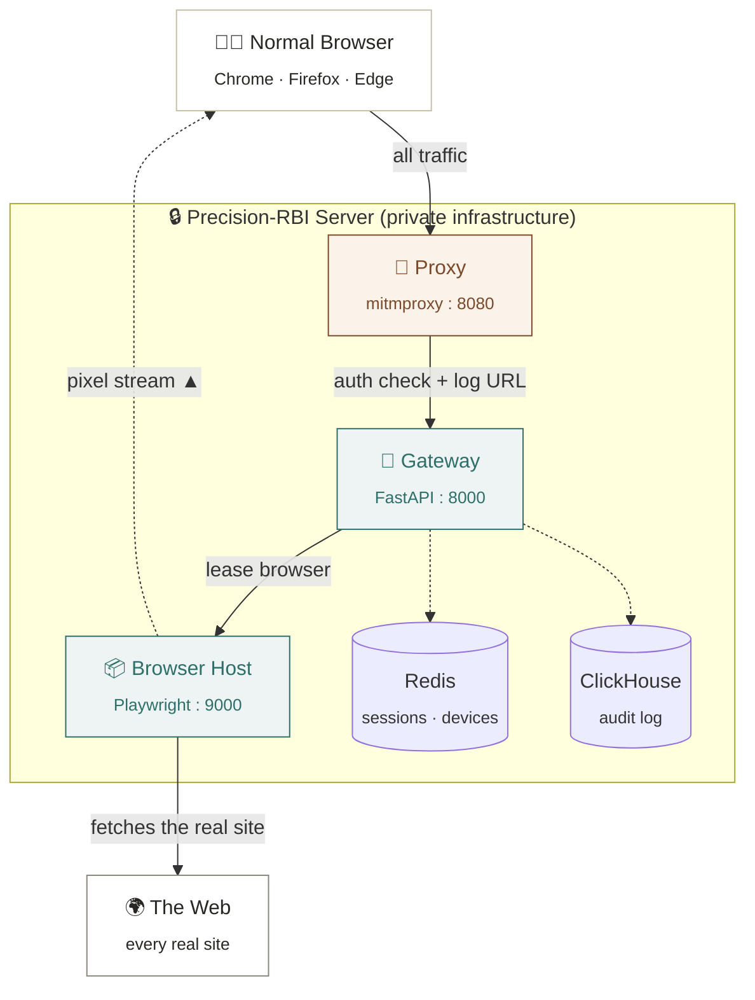
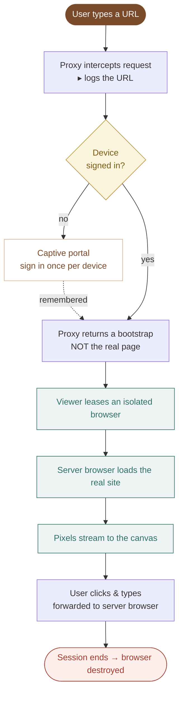

<div align="center">

# 🛡️ Precision-RBI

### *Remote Browser Isolation — websites run on our server, users only ever see pixels.*

<br>


<br>


</div>

---

> [!NOTE]
> **The one-line principle:** *You cannot be harmed by code you never run.*
> Every website a user visits is fetched, executed, and rendered inside a disposable browser **on our server**. Only a live image of the result is streamed back. The user keeps their normal browser and habits — no plugin, no manual steps.

---
## 📐 Architecture & System Design

Explore the full interactive design briefing — architecture, user flow, and the terminal/OS/browser workflow:

<div align="center">

[](https://krithiikaa.github.io/Precision-RBI-Docker/)

</div>

## ✨ What it does

| Requirement | How Precision-RBI delivers it |
| :--- | :--- |
| 🌐 **Any browser, normal habits** | A transparent proxy intercepts traffic from unmodified Chrome / Firefox / Edge. |
| 🖥️ **Runs on the server first** | The site is rendered by an isolated Chromium on the server before anything reaches the user. |
| 🚫 **No manual `?url=` step** | The proxy captures the address bar automatically and swaps the page for a stream. |
| 📝 **Capture every user log** | Every URL, per user, lands in an append-only ClickHouse audit table. |
| 🔑 **Login once per user** | A captive portal signs the device in a single time; it is remembered after that. |
| 🎞️ **Pixel-stream isolation** | The page is streamed as live JPEG frames; clicks and keys are forwarded back. |

---

## 🏗️ Architecture



> Above the boundary is the user's world; below it is private infrastructure. Only the **proxy** straddles the line — the page's code never crosses it.

---

## 🔄 Request flow (end to end)



---

## 🧩 The five services

| Service | Port | Role |
| :--- | :---: | :--- |
| 🚪 **Proxy** | `8080` | The single door. Intercepts every request, identifies the device, logs the URL, swaps each page for a streaming bootstrap. |
| 🧠 **Gateway** | `8000` | The brain. One-time login, leases browsers, serves the viewer, relays the pixel stream so the host stays private. |
| 📦 **Browser Host** | `9000` | Where danger is contained. Disposable Chromium runs the real site, emits JPEG frames, accepts forwarded input. |
| 🗃️ **Redis** | `6379` | Session & device store — who is who, which browser is leased to which session. |
| 📊 **ClickHouse** | `8123` | Append-only audit log of every URL every user reached. |

---

## 📁 Folder structure

```text
precision-rbi/
├── docker-compose.yml        # orchestrates all five services
├── .env.example              # copy to .env, set secrets
│
├── proxy/                    # 🚪 transparent MITM interception
│   ├── addon.py              #    intercept · gate · log · bootstrap
│   ├── proxy.pac             #    routes browser traffic, exempts infra
│   ├── extract-ca.sh         #    pull the CA cert for MDM rollout
│   ├── Dockerfile
│   └── requirements.txt
│
├── gateway/                  # 🧠 control plane (FastAPI)
│   ├── app/
│   │   ├── main.py           #    app entry, routers, /log endpoint
│   │   ├── config.py         #    settings & env
│   │   ├── deps.py           #    auth dependency
│   │   ├── routers/
│   │   │   ├── auth_router.py     # login once · silent refresh
│   │   │   ├── portal_router.py   # captive portal · session lease
│   │   │   ├── session_router.py  # legacy DOM-mirror channel
│   │   │   └── stream_router.py   # pixel-stream relay → host
│   │   ├── services/
│   │   │   ├── auth.py            # JWT issue / verify / refresh
│   │   │   ├── sessions.py        # Redis session store
│   │   │   ├── devices.py         # device ↔ user (captive portal)
│   │   │   ├── browser_client.py  # talks to the browser host
│   │   │   └── audit.py           # ships every event to ClickHouse
│   │   └── static/
│   │       ├── portal.html        # one-time sign-in page
│   │       ├── viewer.html        # canvas: renders frames, sends input
│   │       └── index.html         # legacy DOM-mirror portal
│   ├── Dockerfile
│   └── requirements.txt
│
├── browser-host/             # 📦 isolated Chromium pool (Playwright)
│   ├── app/main.py           #    lease · navigate · screencast · input
│   ├── Dockerfile
│   └── requirements.txt
│
├── logging/
│   └── schema.sql            # 📊 ClickHouse audit table
│
└── docs/
    ├── DEPLOY-PROXY.md             # MDM rollout (CA · PAC · policy)
    └── Precision-RBI-Architecture.html   # full design briefing
```

---

## 🚀 Quick start

> [!IMPORTANT]
> Requires **Docker** + **Docker Compose**. On Linux, prefix with `sudo` unless your user is in the `docker` group.

### 1 — Build and run everything

```bash
# from the project root
cp .env.example .env          # set JWT_SECRET and ADMIN_PASSWORD
sudo docker compose up --build
```

Wait until you see:

```text
gateway-1   | Uvicorn running on http://0.0.0.0:8000
proxy-1     | HTTP(S) proxy listening at *:8080.
```

### 2 — Make `rbi.local` resolve to this machine

```bash
echo "127.0.0.1  rbi.local" | sudo tee -a /etc/hosts
```

### 3 — Pull the CA certificate (for trusting HTTPS interception)

```bash
cd proxy && bash extract-ca.sh
# → produces precision-rbi-ca.pem
```

### 4 — Point a browser through the proxy

**Any browser via the OS (recommended — covers Chrome / Edge / Brave at once):**

```bash
# trust the CA system-wide
sudo cp proxy/precision-rbi-ca.pem /usr/local/share/ca-certificates/precision-rbi-ca.crt
sudo update-ca-certificates
# then set the system proxy to  rbi.local:8080  (ignore: rbi.local, localhost, 127.0.0.1)
```

**Or launch Chrome directly for a quick test:**

```bash
google-chrome \
  --proxy-server="rbi.local:8080" \
  --proxy-bypass-list="rbi.local;localhost;127.0.0.1"
```

### 5 — Browse

Open any `https://` site → sign in **once** at the portal (`admin` / `admin123`) → every site after that streams through the isolated server browser. ✅

---

## 📊 Verify logging

Every URL every user visits is captured. Query the audit table:

```bash
sudo docker compose exec clickhouse clickhouse-client \
  --query "SELECT ts, user_id, event_type, url
           FROM rbi.audit
           ORDER BY ts DESC
           LIMIT 50"
```

---

## 🛠️ Operating commands

```bash
sudo docker compose up --build -d      # run in the background
sudo docker compose logs -f proxy      # follow proxy logs
sudo docker compose logs -f gateway    # follow gateway logs
sudo docker compose ps                 # list running services
sudo docker compose down               # stop and remove containers
sudo docker compose down -v            # also wipe volumes (fresh start)
```

---

## 🔐 Why a certificate is required

To render an HTTPS page on the server, the proxy must **decrypt** the request — which means the browser has to trust the proxy's certificate authority.

> [!WARNING]
> This CA can impersonate **any** website to every device that trusts it. It is the most sensitive secret in the system. Precision-RBI is intended **only for devices an organisation owns and administers** (pushed via MDM), never imposed on people who didn't consent. Guard the `mitm_ca` volume; in production use an HSM-backed CA.

Large sites with HSTS-preload raise `MITM_DETECTED`. The fix is enterprise-root trust (`security.enterprise_roots.enabled` for Firefox), pushed as policy on managed devices. See [`docs/DEPLOY-PROXY.md`](docs/DEPLOY-PROXY.md).

---

## 🗺️ Roadmap

- [x] Transparent interception from an unmodified browser
- [x] One-time login per device
- [x] Full URL capture → ClickHouse
- [x] Disposable isolated rendering + pixel stream + input
- [x] HSTS-preload site handling
- [ ] **WebRTC streaming** — replace JPEG-over-two-hops (biggest UX win)
- [ ] **Session & pool management** — reuse one browser per user, idle eviction, autoscale
- [ ] **Edge features** — download scanning (CDR), clipboard control, HSM-backed CA

---

<div align="center">
  
  
  *Created with ❤️ by Krithiikaa. 🛡️ Isolate every website. Stream back only pixels. 🎞️.*
</div>
